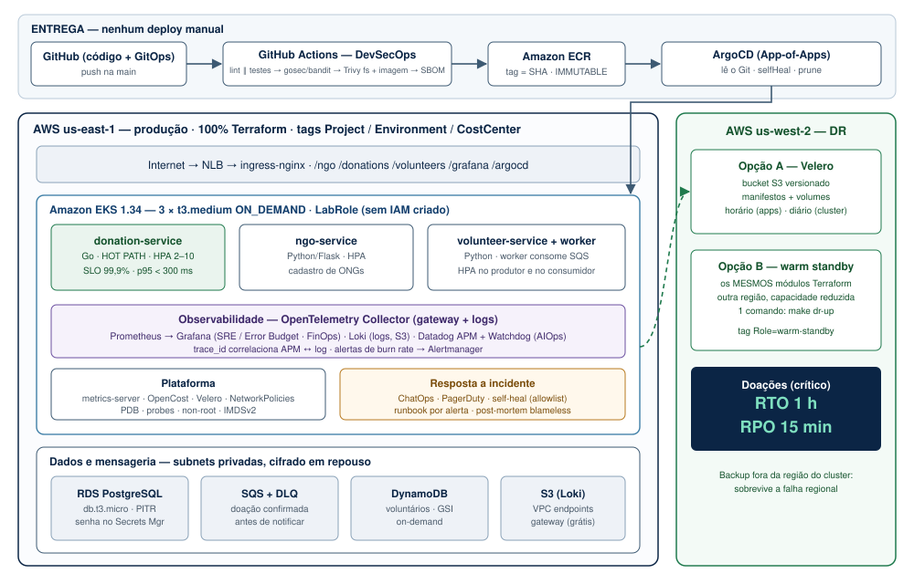
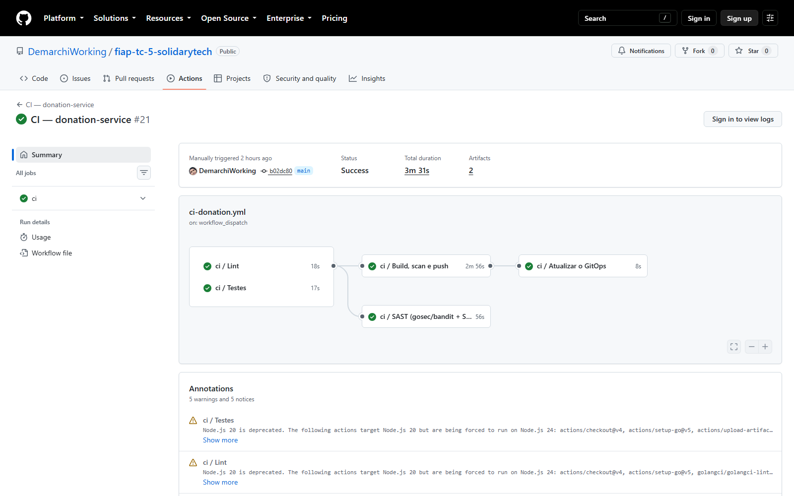
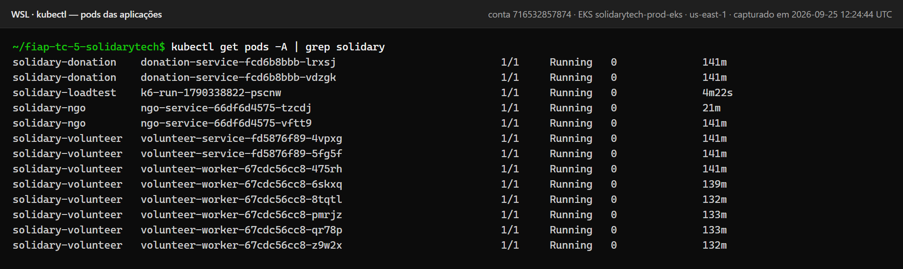
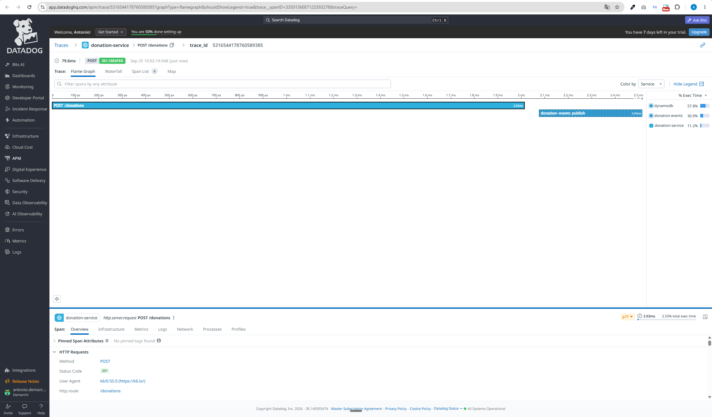
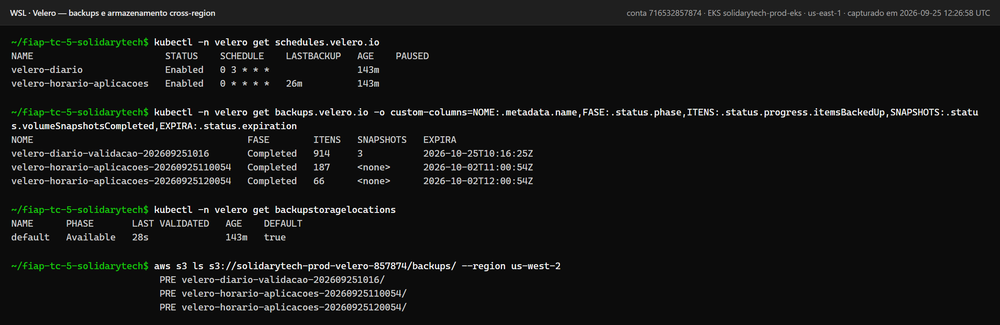
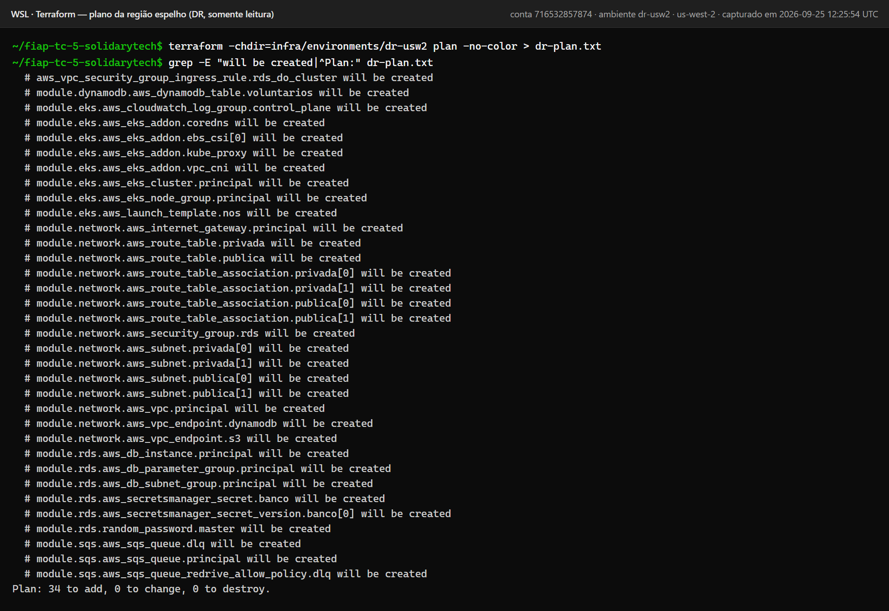
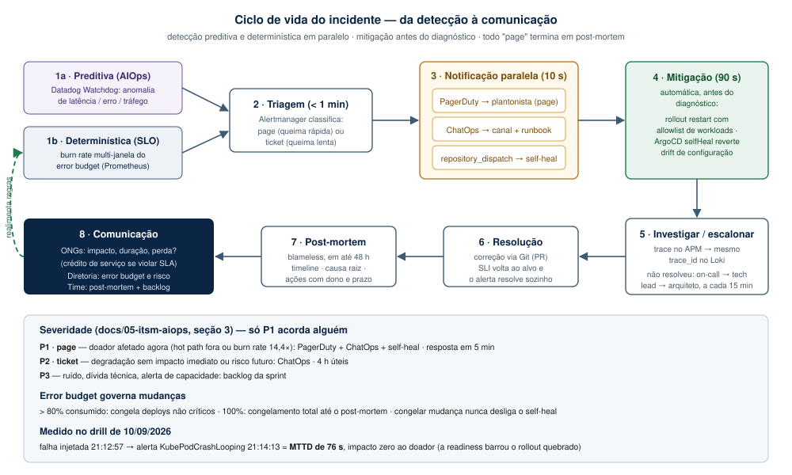
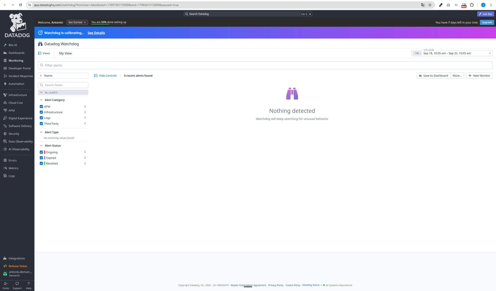

# Relatório de Entrega — Tech Challenge Fase 5 (Hackathon)

**SolidaryTech — plataforma de doações em AWS**
FIAP PosTech · DevOps & Arquitetura Cloud · Setembro de 2026

> Este documento é a **fonte** do PDF exigido no entregável **E3**. Ele vive em
> Markdown para entrar em diff e ser revisado em PR como qualquer outro
> artefato; o PDF é gerado a partir dele com `make relatorio`.
>
> A instrução anterior era `pandoc ... -o .pdf`, que **não funciona sem um motor
> LaTeX instalado** (texlive, vários GB) — o comando falha com `pdflatex not
> found`, e a véspera da entrega é o pior momento para descobrir isso. O
> `make relatorio` não instala nada: converte para HTML com CSS de impressão e
> usa o Edge ou o Chrome que já existem na máquina, em modo headless. Saída em
> `docs/relatorio/RELATORIO-FASE5.pdf`.

---

## 1. Identificação (E3.1)

| Nome | RM | Username GitHub |
|---|---|---|
| Leonardo Alves Freitas | rm369434 | `freitasleoalves` |
| Antonio Eduardo Silveira Demarchi | rm370045 | `demarchiworking` |

| Item | Link |
|---|---|
| **Repositório** (E3.2) | https://github.com/DemarchiWorking/fiap-tc-5-solidarytech |
| **Vídeo** (E3.2) | *a preencher* |

---

## 2. Resumo executivo

A SolidaryTech é uma plataforma sem fins lucrativos que conecta ONGs, doadores e
voluntários. Depois de ganhar destaque em rede nacional, passou a receber picos
de acesso imprevisíveis, e a diretoria estabeleceu quatro exigências: **as
doações não podem parar**, **o custo precisa ser justificado**, **os incidentes
precisam ser previstos** e **os acordos com as ONGs precisam ser claros**.

Esta entrega responde às quatro com número medido, não com intenção.

| Exigência da diretoria | Resposta | Evidência |
|---|---|---|
| Se a nuvem cair, as doações não param | RTO 1 h · RPO 15 min, com DR cross-region testado | §6 |
| O custo precisa ser justificado | US$ 202/mês, com custo por serviço e 5 otimizações quantificadas | §5 |
| Os incidentes precisam ser preditivos | AIOps + burn rate de error budget · MTTR de ~10 h para ~10 min | §4, §7 |
| SLO/SLA claros com as ONGs | 3 SLIs medidos · SLO 99,9% · SLA 99,5% com crédito de serviço | §4 |

### Ambiente: AWS Academy Learner Lab

Todo o projeto roda no ambiente gratuito que a FIAP disponibiliza. Isso **não é
um detalhe de execução — é a restrição que moldou a arquitetura**. O Learner Lab
bloqueia a criação de IAM roles, users e OIDC providers, o que elimina IRSA,
`eksctl`, o AWS Load Balancer Controller e a federação OIDC do GitHub Actions.

Cada contorno está documentado em ADR, com o desenho de produção ao lado.
Nenhuma restrição foi escondida.

### Arquitetura



---

## 3. Fundação DevOps — Fases 1 a 4 (Requisito obrigatório)

| # | Requisito | Como foi atendido |
|---|---|---|
| **F0.1** | Docker e Kubernetes | Dockerfiles multi-stage com estágio de teste, usuário não-root por UID e `HEALTHCHECK`. Go em **distroless**; Python sem compilador na imagem final. Deploy em **EKS** |
| **F0.2** | IaC (Terraform) | 21 arquivos `.tf`: backend S3+DynamoDB, 8 módulos, 2 ambientes. **Cluster, bancos, mensageria e rede** — 100% por código |
| **F0.3** | CI/CD DevSecOps | Pipeline reutilizável: `lint‖test` → `sast`+`build-scan-push` → `update-gitops`. **SAST:** gosec (Go) e bandit (Python), sempre; SonarCloud entra quando o `SONAR_TOKEN` está configurado. **SCA: Trivy em 2 camadas** (dependências + imagem, CRITICAL bloqueia), SARIF na aba Security, SBOM CycloneDX. `gitleaks` no histórico: 0 achados em 84 commits |
| **F0.4** | GitOps | **ArgoCD** com App-of-Apps → ApplicationSet. `selfHeal` e `prune` ligados. Um único `kubectl apply` em todo o projeto |
| **F0.5** | Observabilidade e APM | Prometheus, Grafana, Loki (S3), **dois** OTel Collectors. **Datadog** com Distributed Tracing atravessando o SQS e trace metrics pelo `datadog/connector`. Em 24/09: chave validada, **0 respostas 403**, 52 mil spans no ciclo de carga ([`apm-datadog.txt`](../07-evidencias/apm-datadog.txt)) |

Comparativo completo das três entregas:
[`docs/02-arquitetura/evolucao-v3-v4-v5.md`](../02-arquitetura/evolucao-v3-v4-v5.md)

### Melhorias sobre a entrega da Fase 4

| Lacuna da Fase 4 | Correção nesta entrega |
|---|---|
| **Sem métrica de latência** — só contador; SLO de latência era incalculável | Histograma `solidary.http.server.duration` com nome, unidade e buckets **idênticos em Go e Python** |
| **SLOs "propostos, não implementados"** | `PrometheusRule` com burn rate multi-janela e error budget renderizado em painel |
| **Segredos reais versionados em texto puro** (senha do Postgres, chave do Service Bus, `DD_API_KEY`) | Senha no **Secrets Manager**; credencial de nuvem via **IMDS** — não existe como segredo. `gitleaks` no CI |
| **IP público do LB fixado no `values.yaml`** — quebrava a cada recriação | Hostname vindo do output do Terraform |
| **Sem `startupProbe`, sem `PodDisruptionBudget`** | Ambos em todos os workloads |
| **Fila sem consumidor** — trace terminava no produtor | `volunteer-worker` acrescentado; trace ponta a ponta real |

### Correções no código fornecido pelo enunciado

O `donation-service` original **não compila** (`strconv` e `fmt` importados e não
usados — em Go isso é erro, não aviso). O `volunteer-service` respondia **500
permanente** em `GET /volunteers/<ngo_id>`, porque o DynamoDB retorna números
como `decimal.Decimal` e o encoder JSON do Flask não serializa esse tipo.

**22 defeitos corrigidos**, todos com teste de regressão. Tabela completa em
[`services/README.md`](../../services/README.md).

### Auditoria final e reprovisionamento (24/09)

Antes da entrega, o ambiente foi **destruído e recriado do zero numa conta de
Learner Lab diferente** — a prova mais dura de que tudo é código. A auditoria
e a própria subida encontraram dezesseis defeitos, nenhum visível para os gates:

| Defeito | Efeito | Correção |
|---|---|---|
| 3 CVEs HIGH novas no `grpc` 1.79.3 | Apareceriam na aba Security | `grpc` 1.83.2 · Trivy: 0 HIGH/CRITICAL |
| `pip` vendorizado nas imagens Python | 2 HIGH por imagem | `pip` removido do runtime |
| Bucket do Velero e ambiente DR com `Environment=DR` | Fora do filtro `Environment=Production` | Tag própria `Role`; **gate novo** barra a regressão |
| Healthcheck do LocalStack em rota inexistente | `make smoke` nunca passava do boot | Rota corrigida |
| Schema do donation aplicado no banco errado (local) | `POST /donations` → 500 no smoke | Schema aplicado no `donation_db` |
| `configurar-repo` só trocava placeholders | Em conta nova: pods sem imagem, Loki e Velero sem bucket | Migra registry e buckets da conta anterior |
| Pré-voo dizia "configurado" para outra conta | Falso GO | Compara o ID da conta e o bucket de state |
| **ArgoCD apagava os backups do Velero** (label do Schedule copiado para o Backup) | `velero backup get` vazio com os dados no S3; restore inviável | Tipos operacionais do Velero excluídos do ArgoCD |
| **Site do Datadog fixo em `us5`**; a chave do grupo é do US1 | 403 em todo envio, sem erro na subida | Site gravado junto com a chave e descoberto pela API |
| **Sem trace metrics**: na versão 0.159 o exporter não as calcula (`DisableAPMStats`) | Watchdog sem métricas para analisar | `datadog/connector` + pipeline dedicado |
| Contador de spans "enviados" usado como prova de entrega | 51.705 "enviados" com todo payload recusado | Prova = chave validada + 0 × 403 + contador |
| Chave do APM em `export`, `--from-literal` e `.env.local` (`chmod 600` vira 777 em `/mnt/c`) | Chave no histórico, em `ps` e em disco | **Cofre** (Secrets Manager) — ADR-014 |
| **`ngo-service` alcançava o IMDS** (policy copiada do donation) | API pública e sem autenticação a um passo da credencial da LabRole | Saída só para DNS, Collector e banco — medido: IMDS e internet bloqueados |
| **Grafana exposto e sem NetworkPolicy** | SSRF pelo proxy de datasources até o IMDS | Policy que bloqueia só o IMDS — medido: bloqueado, datasources ok |
| `commonLabels` injetava labels no `podSelector` | Policy aplicada e sem efeito, em silêncio | `labels` com `includeSelectors: false` |
| Verificador de links só existia na CI | CI vermelha duas vezes com os gates locais verdes | Um script só, chamado pela CI e pelo `./solidary check` |

Os dois defeitos do smoke se escondiam mutuamente: com o healthcheck quebrado,
o teste nunca chegava ao hot path, onde o segundo estava. E os quatro do
Datadog só aparecem com o sistema **operando**: o Collector sobe, o contador
de envio sobe, e nada chega ao APM.

**Medido no ambiente recriado:** 52 recursos por Terraform em 15 min, **0 IAM** ·
15/15 Applications `Synced`/`Healthy` · todos os pods de aplicação com 0 reinício ·
todas as rotas públicas respondendo, `POST /donations` → 201 · carga do k6:
12.879 requisições, **0% de falha**, p95 de 7,9 ms · worker escalado 1 → 6
pelo HPA ([`validacao-final.txt`](../07-evidencias/validacao-final.txt)).

**Revalidado em 25/09 numa terceira conta (`716532857874`)**, de novo do zero:
bootstrap e 52 recursos aplicados a partir de planos revisados (0 IAM) · CI dos
três serviços publicou no ECR e commitou as tags no GitOps; o ArgoCD implantou
a imagem da CI · 15/15 Applications `Synced`/`Healthy` · API pública com as 11
respostas esperadas (201, 409, 400, 200) · k6: 12.879 requisições, **0% de
falha**, p95 de 7,2 ms · Datadog: 51.733 spans entregues, **0 × 403** · Velero:
backup de 914 itens e restore em 12 s · DR: plano 34/0/0. Nenhuma linha de
código mudou entre as contas — só a configuração gerada por `configurar-repo`.

### Evidências — Fundação








---

## 4. Seção SRE (E3.3)

> **Evidência visual obrigatória:** definição formal de SLI, SLO e SLA do serviço
> de doações.

**Documento completo:** [`docs/03-sre/sli-slo-sla.md`](../03-sre/sli-slo-sla.md)

### SLIs e SLOs do `donation-service`

| # | SLI | Golden Metric | SLO | Error budget |
|---|---|---|---|---|
| 1 | Proporção de requisições **não-5xx** | Errors | **99,9%** / 7 d | 0,1% |
| 2 | Proporção servida em **< 300 ms** | Latency | **99%** / 7 d | 1% |
| 3 | Eventos processados em **< 60 s** | Saturation | **99,5%** / 7 d | 0,5% |

> O enunciado exige no mínimo dois. Entregamos três — e o terceiro é o que fecha
> um ponto cego real: a doação é confirmada **antes** do consumo da fila, então o
> worker poderia estar parado há horas com os outros dois SLIs verdes.

### SLA com as ONGs parceiras

| | SLO (interno) | SLA (contratual) |
|---|---|---|
| Disponibilidade | 99,9% | **99,5%** ao mês |
| Latência | 99% < 300 ms | 95% < 1 s |
| Consequência | Congelamento de deploy | **Crédito de serviço** |

O SLA é mais frouxo que o SLO de propósito: os ~3,2 h/mês de folga são o que
absorve um incidente ruim sem quebrar contrato.

### Política de error budget — automatizada

| Consumido | Ação |
|---|---|
| > 80% | **Congelamento de deploys não críticos** (hotfix e self-heal seguem) |
| 100% | **Congelamento total** até o post-mortem concluído |

Aplicado removendo `syncPolicy.automated` do Application — o ArgoCD para de
sincronizar, mas o self-heal continua funcionando. Congelar mudanças **não pode**
significar congelar a capacidade de mitigar.

### O error budget em ação — um achado real do teste de carga

O ciclo abaixo não é ilustrativo. Aconteceu neste ambiente, e é a melhor
evidência de que os SLIs fazem trabalho de verdade.

**Detecção.** Depois da primeira carga (8.755 eventos), o SLI de frescor
acusou:

| | |
|---|---|
| Eventos com lag ≤ 60 s | 6.137 — **70,1 %** |
| Eventos com lag > 60 s | 2.618 — **29,9 %** |
| Lag médio | 39,7 s |
| Error budget restante | **−42,38** (estourado em mais de 40×) |

Os outros dois SLIs estavam verdes. Só o de frescor viu — e é exatamente o
ponto cego que ele foi criado para cobrir: a doação é confirmada **antes** do
consumo da fila.

**Diagnóstico.** Duas causas somadas, nenhuma delas produzindo erro:

1. **O EKS não instala o `metrics-server`, e ninguém instalou.** Sem a API
   `metrics.k8s.io`, um HPA não falha — fica em `<unknown>` e nunca escala. Os
   três HPAs do projeto estavam declarados, criados, listados, e eram
   **decorativos**. `kubectl top` também não respondia.

2. **O `volunteer-worker` não tinha HPA nenhum.** Rodava fixo em 1 réplica com
   50 m de CPU. O produtor escalava (na intenção); o consumidor, não.

O script do k6 tem um estágio comentado como *"PICO — dispara o HPA"*. O pico
chegava, e nada disparava.

**Por que nenhum gate pegou.** `kustomize build`, `kubeconform`,
`terraform validate` e os cinco gates locais validam a **forma**. Nenhum deles
executa um cluster, e um HPA sintaticamente perfeito que nunca escala passa por
todos. Foi preciso rodar carga contra o ambiente real para o defeito aparecer.

**Ação.** Pelo GitOps, em dois commits: `metrics-server` como addon (onda de
sync −2, antes de tudo) e HPA próprio para o worker.

**Recuperação.** Assim que a Metrics API subiu, o HPA do worker leu **194 %** de
utilização e escalou sozinho em 81 segundos. Na carga seguinte:

| | Antes | Depois |
|---|---|---|
| Réplicas do worker | 1 (fixo) | 1 → 6 (HPA) |
| Eventos fora do alvo | 29,9 % | **0,1 %** (4.862 de 4.867) |
| `kubectl get hpa` | `cpu: <unknown>/70%` | `cpu: 1%/70%` |

**O que o pico revelou de quebra.** O HPA chegou a **404 %** de utilização — o
request de 50 m estava quatro vezes abaixo do uso real (~200 m). Isso não mata
o pod, porque o *limit* não era atingido; o que se degrada em silêncio é o
**agendamento**: o scheduler acreditava que quatro workers custavam 200 m
quando custavam 800 m. Corrigido para 100 m de request — o dobro do regime e
metade do pico, porque request igual ao pico faria a utilização nunca passar de
100 % e o HPA nunca escalar.

**O orçamento de 7 dias não voltou ao verde**, e não deveria. A taxa
instantânea está no alvo; o error budget leva dias para cicatrizar. É essa a
função dele: lembrar do que aconteceu depois que o gráfico já voltou ao normal.

**Evidência:** [`elasticidade-e-frescor.txt`](../07-evidencias/elasticidade-e-frescor.txt)

### MTTR (F1.3)

| Etapa | Sem a stack | Com a stack | Origem do número |
|---|---|---|---|
| Detecção | ~6 h (usuário reclama) | **76 s** | **Medido** no chaos drill de 10/09 |
| Diagnóstico | ~4 h (logs por pod) | ~5 min (`trace_id`: APM ↔ Loki) | Projeção |
| Mitigação | minutos, se houver alguém | ~90 s (self-heal) | Meta do runbook |
| **Total** | **~10 h** | **~10 min** | Projeção ancorada na detecção medida |

A detecção é o número medido; as demais etapas são metas de projeto, e estão
rotuladas como tal. No drill, a mitigação automática nem foi necessária: a
readiness barrou o rollout quebrado e **o doador não percebeu o incidente** —
as duas réplicas antigas seguiram servindo durante os 13 minutos de falha.

Procedimento e execução: [`mttr-chaos-drill.md`](../03-sre/mttr-chaos-drill.md) ·
post-mortem real: [`post-mortem-2026-09-10-frescor.md`](../05-itsm-aiops/post-mortem-2026-09-10-frescor.md).

### Os SLIs no ambiente recriado (24/09, após a carga)

| SLI | Valor medido | SLO |
|---|---|---|
| Taxa de erro (5 min) | **0** | ≤ 0,1% |
| Latência p95 | **4,8 ms** | 99% < 300 ms |
| Frescor da fila — erro (1 h) | **0** | ≤ 0,5% |
| Error budget restante (disponibilidade) | **100%** | — |

Prometheus com 27 alvos, 0 fora do ar. Fonte:
[`validacao-final.txt`](../07-evidencias/validacao-final.txt), seção G.

### Evidências — SRE


---

## 5. Seção FinOps (E3.4)

> **Evidência visual obrigatória:** análise de custos mensais (Forecast) e
> evidências das tags aplicadas.

**Documento completo:** [`docs/04-finops/README.md`](../04-finops/README.md)

### Forecast — US$ 202,74/mês

| Item | US$/mês |
|---|---:|
| EKS control plane | 72,00 |
| 3 × `t3.medium` | 90,00 |
| RDS `db.t3.micro` | 12,90 |
| NLB | 16,20 |
| EBS (nós + PVCs) | 8,24 |
| S3 + DynamoDB + SQS + ECR + CloudWatch | 2,60 |
| Secrets Manager (senha do RDS e credencial do APM) | 0,80 |
| **Total** | **202,74** |

O Secrets Manager entrou em 24/09: a senha do RDS já vivia lá sem estar no
forecast, e a credencial do APM passou a viver também (ADR-014).

### Tags obrigatórias

`Project=SolidaryTech` · `Environment=Production` · `CostCenter=NGO-Core`
(+ `ManagedBy`, `Owner`, `Phase`)

Aplicadas por `default_tags` no provider. **A armadilha:** `default_tags` **não
alcança** as EC2 nem os volumes de um managed node group — e são eles que
dominam a fatura. Resolvido com **launch template** e `tag_specifications`.

**Os valores são literais em 100% dos recursos**, inclusive no bucket de backup
e na região de DR. O custo da resiliência se separa por uma tag própria
(`Role=backup-cross-region`, `Role=warm-standby`), nunca mudando o valor de uma
tag obrigatória — e o gate `verificar-academy.py` (verificação 16) reprova
qualquer `Environment` diferente de `Production` antes do `plan`.

**Medido em 24/09:** 42 recursos com as três tags em `us-east-1` + `us-west-2`,
e **0** recursos do projeto com `Environment` diferente de `Production`.

### Recomendações quantificadas

> O enunciado pede pelo menos uma. São cinco.

| # | Recomendação | Economia |
|---|---|---:|
| 1 | Desligar o ambiente fora de uso (`make lab-down`) | **US$ 155/mês (77%)** |
| 2 | `gp2 → gp3` (aplicado) | ~20% do EBS |
| 3 | `Scan` → `Query` no DynamoDB (GSI já criado) | 60–90% da leitura |
| 4 | Spot Instances — **não aplicável**: o lab só libera On-Demand | (US$ 60/mês em produção) |
| 5 | VPC Endpoints de gateway (aplicado, gratuitos) | elimina custo de NAT p/ S3 e DynamoDB |

### Evidências — FinOps


Tabela de rightsizing antes/depois, com a medição sob carga:
[`docs/04-finops/README.md`](../04-finops/README.md) §2 ·
[`rightsizing-medido.txt`](../07-evidencias/rightsizing-medido.txt).

---

## 6. Seção Segurança e DR (E3.5)

> **Evidência visual obrigatória:** documento de PCN (com RPO e RTO) e explicação
> da estratégia de DR.

**Documento completo:** [`docs/06-dr-pcn/pcn.md`](../06-dr-pcn/pcn.md)

### RTO e RPO

| Serviço | Criticidade | RTO | RPO |
|---|---|---|---|
| **`donation-service`** | **Crítica** | **1 h** | **15 min** |
| `ngo-service` | Alta | 4 h | 24 h |
| `volunteer-service` | Média | 8 h | 24 h |

Compromisso assimétrico de propósito: uma doação perdida é perda financeira
direta; um cadastro de ONG perdido é um formulário reenviado.

### Estratégia de DR — as duas opções

> O enunciado pede A **ou** B. Entregamos as duas: elas protegem contra falhas
> diferentes.

**Opção A — Velero:** backup de manifestos e volumes para bucket S3 em
**`us-west-2`**, região diferente da do cluster. Horário (aplicações) e diário
(cluster). Autentica pelo **IMDS do nó** — a instalação padrão exigiria IRSA,
bloqueado no lab.

**Opção B — Warm standby:** `make dr-up` sobe a região espelho. O ambiente de DR
**não redefine nada** — chama os mesmos módulos com outra região e capacidade
reduzida. É isso que prova a modularização.

### Débitos de segurança declarados

Consequências do ambiente da faculdade, com o desenho correto documentado:
sem Multi-AZ · sem IRSA · sem TLS/WAF · sem CMK no etcd · credencial estática no
CI (OIDC bloqueado) · nós em subnet pública (decisão de custo revertível por uma
variável) · cofre do APM sem IAM granular — quem tem a sessão da conta lê o
segredo; em produção, role dedicada + External Secrets Operator (ADR-014).

**Medido em 25/09 (conta `716532857874`) — Opção A em ação, e não só configurada:**

| Etapa | Resultado |
|---|---|
| Backup (schedule diário: manifestos **e volumes**) | `Completed` · 914/914 itens · **3/3 snapshots de volume** · 13 s |
| Manifestos | `tar.gz` de 683 KB no bucket de **us-west-2** (outra região) |
| Volumes | 3 snapshots EBS cifrados (Prometheus, Grafana, Alertmanager) |
| **Restore executado** | PVC do Prometheus recuperado do snapshot num namespace isolado: `Completed`, **PVC `Bound` em 12 s**, volume EBS novo criado a partir do snapshot |
| Limpeza do drill | namespace e volume do drill removidos — sem custo órfão |
| Lição registrada | a 1ª tentativa rodou com os snapshots ainda `pending` e falhou; a limpeza automática marcou o PV de produção do Prometheus — contido com `Retain`, sem perda. O drill agora espera os snapshots e só apaga clones do namespace isolado |

Os snapshots de volume são **regionais** (us-east-1) e os manifestos, cross-region.
Os volumes do cluster são só de observabilidade; o dado de doação vive no RDS,
com PITR. Em produção: node-agent do Velero ou cópia dos snapshots pelo AWS
Backup ([`dr-velero-backup-restore.txt`](../07-evidencias/dr-velero-backup-restore.txt), com a lição do drill no item 6).

**Opção B:** plano da região espelho **34 a criar, 0 a alterar, 0 a destruir**,
com as mesmas tags ([`dr-plano-regiao-secundaria.txt`](../07-evidencias/dr-plano-regiao-secundaria.txt)).

### Revisão de segurança da superfície exposta (24/09)

Sem IRSA, a credencial da LabRole está no IMDS de cada nó, e a NetworkPolicy é
a única barreira entre um pod comprometido e a conta AWS. A revisão testou de
dentro dos pods — pedindo só o *token* do IMDSv2, nunca a credencial:

| Superfície | Antes | Depois |
|---|---|---|
| `ngo-service` (API pública, sem autenticação, não usa AWS) | IMDS **200** · internet liberada | IMDS **bloqueado** · internet **bloqueada** · banco e API ok |
| Grafana (exposto, sem NetworkPolicy) | IMDS alcançável pelo proxy de datasources | IMDS **bloqueado** · Prometheus, Loki e API do K8s ok |
| `donation` / `volunteer` (precisam de SQS e DynamoDB) | IMDS liberado | mantido — sem IRSA, é a fonte da credencial |
| Grafana e ArgoCD sem sessão | — | 401 nas APIs; Grafana sem acesso anônimo |
| Security groups | — | abertos à internet só nas NodePorts do ingress |
| RDS · buckets S3 | — | RDS não público e cifrado · 3 buckets com bloqueio público total |

**Risco residual declarado:** Grafana e ArgoCD respondem por **HTTP** (sem
domínio para TLS no lab) — o login deve ser feito por `kubectl port-forward`
fora de rede confiável; endpoint do EKS público, autenticado por IAM; APIs sem
autenticação (ADR-008). Em produção: ACM + TLS no NLB, SSO nas ferramentas de
administração e ferramentas internas atrás de VPN ou SSM.

### Evidências — DR





---

## 7. Seção ITSM e AIOps (E3.6)

> **Evidência visual obrigatória:** desenho do ciclo de vida de incidentes.

**Documento completo:** [`docs/05-itsm-aiops/README.md`](../05-itsm-aiops/README.md)

### Ciclo de vida do incidente



Cada etapa, com metas de tempo e responsáveis, em
[`docs/05-itsm-aiops/README.md`](../05-itsm-aiops/README.md). O ciclo foi
exercitado de verdade: [post-mortem do incidente de 10/09](../05-itsm-aiops/post-mortem-2026-09-10-frescor.md).

### AIOps

**Datadog Watchdog** — detecção automática de anomalias comportamentais,
correlação de eventos e Golden Signals.

A escolha do Datadog está no [ADR-004](../02-arquitetura/adr/README.md), por
**continuidade** com a Fase 4. Em 24/09 a credencial passou a ser a da conta
atual do grupo, no site US1 — e trocar de conta e de site não tocou em uma linha
de código: as aplicações exportam **OTLP puro** e não sabem qual backend recebe o
trace. É esse o ganho de ter o Collector no meio: o backend é configuração.

O caminho contrário também está aberto e versionado: o bloco do exporter
`otlphttp/newrelic` continua no `values.yaml` do Collector, comentado.

**A credencial vive num cofre** (AWS Secrets Manager, `solidarytech/datadog`),
com o site junto — nunca em `export`, arquivo ou Git. Ela é gravada uma vez por
conta com `./solidary datadog` (entrada sem eco, site descoberto na API do
Datadog) e o deploy a materializa no cluster ([ADR-014](../02-arquitetura/adr/README.md)).

**Prova de entrega, e não de envio** — o contador de spans do Collector mede o
que sai dele, não o que o Datadog aceita (chegou a 51.705 com todo payload
recusado). A evidência é a combinação:

```
GET https://api.datadoghq.com/api/v1/validate      -> HTTP 200 {"valid":true}
'API key validation successful' no boot            -> 2
'403 Forbidden' / 'Dropping Payload' no log        -> 0 / 0
otelcol_exporter_sent_spans{exporter="datadog"}    52.135 -> 52.184 (30 requisições)
otelcol_exporter_sent_metric_points{...datadog}    44 -> 49 (trace metrics)
```

**Por que as trace metrics importam para o AIOps:** o Watchdog detecta anomalia
sobre latência, erro e volume por serviço. Na versão 0.159 do Collector o
exporter deixou de calculá-las — o próprio log avisa: *"Trace metrics are now
disabled in the Datadog Exporter by default"*. Sem o `datadog/connector`, o APM
receberia spans e o Watchdog não teria o que analisar.

Detalhes em [`apm-datadog.txt`](../07-evidencias/apm-datadog.txt).

**Watchdog não precisa ser "ligado" por código:** ele analisa automaticamente
todo serviço que envia APM ao Datadog. O que se configura é **para onde vai a
anomalia** — um *Watchdog monitor* (Monitors → New Monitor → Watchdog,
`service:donation-service env:prod`) que notifica o mesmo canal do ChatOps.
A evidência exigida é a anomalia detectada depois do pico de carga do k6.

### Evidências — AIOps



---

## 8. Como reproduzir

```bash
make bootstrap          # 1x por conta: bucket de state
make lab-up             # infraestrutura (~20 min)
make configurar-repo    # ajusta o GitOps para a conta; commit + push
make deploy             # ArgoCD assume e sincroniza tudo
make carga              # gera tráfego para os painéis
make lab-down           # AO FIM DE CADA SESSÃO
```

Detalhes em [`README.md`](../../README.md) e [`infra/README.md`](../../infra/README.md).

---

## 9. Rastreabilidade

Matriz completa requisito → critério → artefato → evidência:
[`docs/01-requisitos-e-criterios-de-aceitacao.md`](../01-requisitos-e-criterios-de-aceitacao.md)

**40 requisitos mapeados** (28 do enunciado + 12 entregáveis), com classificação
de risco de dedução de pontos.
